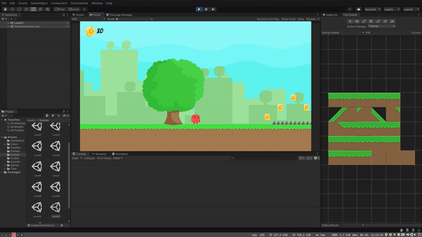

# learn-unity3d

## Description

This repository contains a simple platform game I made during my learning of Unity3D.

## Preview

## License

The [Free Platform Game Assets](https://assetstore.unity.com/packages/2d/environments/free-platform-game-assets-85838) is licensed under the Extension Asset (one license required for each individual user).
See the [Unity EULA](https://unity3d.com/legal/as_terms) for details.

The [background song (Goofy Mischief)](https://soundimage.org/funnyquirky/) is licensed under Royalty-Free License.
See the Wikipedia definition of [Royalty-Free](https://en.wikipedia.org/wiki/Royalty-free) for details.
The [coin gathering song (Coin GET!)](https://freesound.org/people/plasterbrain/sounds/242857/) and [player jump song (Platform Jump)](https://freesound.org/people/josepharaoh99/sounds/362328/) are licensed under the Creative Commons 0 License.
See the [LICENSE-CC0](LICENSE-CC0) file for details.

The scripts of this project is licensed under the MIT License - see the [LICENSE-MIT](LICENSE-MIT) file for details.
